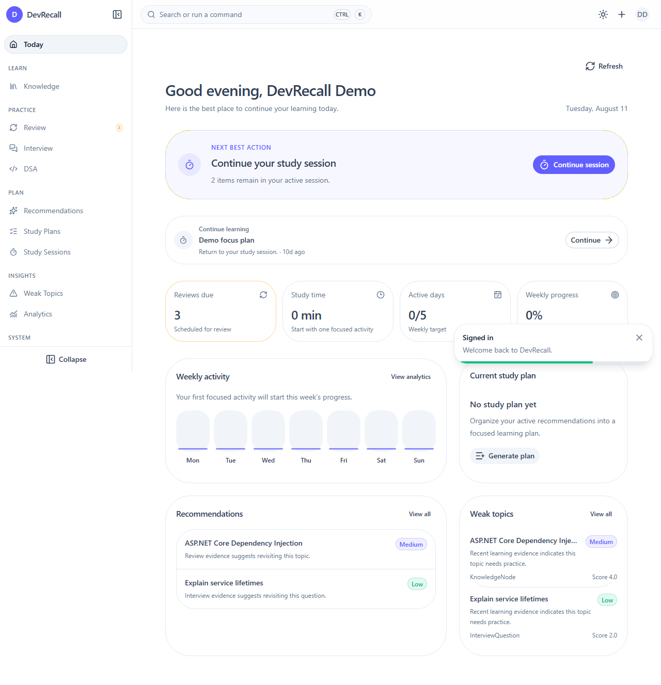

# DevRecall

> A local-first learning and technical interview preparation system for software developers.

DevRecall connects structured knowledge, active recall, spaced repetition, interview preparation, DSA practice, analytics, weak-topic detection, recommendations, and personalized study plans in one workflow.

```text
Capture → Practice → Evaluate → Review → Detect Weakness
        → Recommend Action → Plan Learning → Execute Session
```



## Why DevRecall?

Most learning tools store information but do not close the feedback loop. DevRecall is designed to answer three practical questions:

1. What should I study next?
2. What am I starting to forget?
3. Which topics need more practice?

It is intentionally local-first and backend-focused. AI evaluation, cloud synchronization, social features, and multi-user collaboration are outside the current MVP.

## Features

### Today workspace

- Action-first dashboard with a deterministic Next Best Action policy
- Personalized onboarding and weekly learning targets
- Weekly metrics, current Study Plan, recommendations, Weak Topics, and seven-day activity
- Continue Learning from the latest resumable activity
- Quick Capture for Knowledge, Interview Questions, and DSA Problems
- Lightweight navigation indicators and targeted data refresh after learning mutations

### Knowledge management

- Hierarchical knowledge tree with move, reorder, and archive behavior
- Notes, descriptions, source references, and tags
- Cycle-safe parent changes and user-scoped ownership

### Interview preparation

- Interview question bank with difficulty and topic filtering
- Draft and immutable published answer versions
- Ordered follow-up questions and archived-question handling

### DSA practice

- DSA problem catalog with topics, difficulty, source, and status
- Immutable attempt history, result tracking, notes, code, and complexity analysis
- Attempt comparison and latest-successful-attempt views

### Review and study

- Review scheduling with Again, Hard, Good, and Easy ratings
- Due-review queue and immutable review history
- Study sessions with ordered items and progress lifecycle
- Personalized study plans generated from active recommendations
- Draft editing, Ready/Cancelled lifecycle, and atomic conversion to study sessions

### Analytics and recommendations

- Progress overview, daily activity, module breakdown, review performance, and DSA metrics
- Deterministic weak-topic scoring from learning activity
- Priority-ranked recommendations with lifecycle and expiration reasons
- Resource-summary batching and owner-scoped read models

### Platform foundation

- Secure cookie authentication and authenticated-user authorization policy
- RFC Problem Details with stable business error codes
- Request correlation through `X-Correlation-ID`
- OpenAPI document generation
- Liveness and PostgreSQL readiness checks
- PostgreSQL migrations, optimistic concurrency, and transactional workflows

## Architecture

DevRecall is a backend-first modular monolith using Clean Architecture with pragmatic boundaries.

```text
DevRecall.Api
    ↓
DevRecall.Application
    ↓
DevRecall.Domain

DevRecall.Infrastructure → implements inward-facing abstractions
DevRecall.Contracts      → defines public transport contracts
```

| Project | Responsibility |
| --- | --- |
| `DevRecall.Domain` | Aggregates, entities, value objects, invariants, and state transitions |
| `DevRecall.Application` | Use cases, validation, authorization, DTOs, and infrastructure abstractions |
| `DevRecall.Infrastructure` | EF Core, PostgreSQL, authentication support, clocks, and query implementations |
| `DevRecall.Api` | HTTP endpoints, middleware, Problem Details, OpenAPI, and dependency registration |
| `DevRecall.Contracts` | Public API request and response models |
| `frontend/devrecall-web` | Nuxt application, public SSR layer, Learning OS, and typed HTTP integration |

Business logic remains framework-independent, API endpoints do not access `DbContext` directly, and read endpoints project DTOs instead of exposing EF entities.

See [AGENTS.md](./AGENTS.md) for the complete engineering rules.

## Technology stack

| Area | Technologies |
| --- | --- |
| Backend | .NET 10, ASP.NET Core Minimal APIs, Entity Framework Core |
| Database | PostgreSQL 17, Npgsql |
| Frontend | Nuxt 4, Vue 3, TypeScript, Nuxt UI, Pinia, PrimeVue Tree, Apache ECharts |
| API | REST, OpenAPI, cookie authentication, Problem Details |
| Testing | xUnit, FluentAssertions, Testcontainers, ASP.NET Core integration tests |
| Tooling | Docker Compose, central NuGet package management, ESLint, Oxlint, Vitest, Playwright |

## Repository structure

```text
DevRecall/
├── src/
│   ├── DevRecall.Api/
│   ├── DevRecall.Application/
│   ├── DevRecall.Contracts/
│   ├── DevRecall.Domain/
│   └── DevRecall.Infrastructure/
├── tests/
│   ├── DevRecall.Api.Tests/
│   ├── DevRecall.Application.Tests/
│   ├── DevRecall.Domain.Tests/
│   └── DevRecall.IntegrationTests/
├── DevRecall.ArchitectureTests/
├── frontend/devrecall-web/
├── deploy/
├── docs/
├── Directory.Build.props
├── Directory.Packages.props
└── DevRecall.slnx
```

## Getting started

### Prerequisites

- [.NET 10 SDK](https://dotnet.microsoft.com/download)
- Node.js `22.18+` or `24.12+`
- Docker Desktop or another Docker-compatible runtime
- A trusted ASP.NET Core development certificate for HTTPS

Trust the local HTTPS certificate once:

```powershell
dotnet dev-certs https --trust
```

### 1. Start PostgreSQL

Create the local Docker environment file:

```powershell
Copy-Item deploy/.env.example deploy/.env
```

Review `deploy/.env`, then start PostgreSQL:

```powershell
docker compose --env-file deploy/.env -f deploy/docker-compose.yml up -d postgres
```

### 2. Configure the API connection string

The API intentionally does not store credentials in committed configuration files. Configure the development connection with User Secrets:

```powershell
dotnet user-secrets set "ConnectionStrings:Database" "Host=localhost;Port=5432;Database=devrecall;Username=devrecall;Password=change_me" --project src/DevRecall.Api
```

Keep these values aligned with `deploy/.env`.

### 3. Restore packages and apply migrations

```powershell
dotnet restore DevRecall.slnx
dotnet ef database update --project src/DevRecall.Infrastructure --startup-project src/DevRecall.Api
```

### 4. Run the API

```powershell
dotnet run --project src/DevRecall.Api --launch-profile https
```

The development API listens on:

- HTTPS: `https://localhost:7081`
- HTTP: `http://localhost:5012` (redirected to HTTPS)

### 5. Run the frontend

The development environment targets `https://localhost:7081/api/v1`. To create a local override, copy the example file:

```powershell
Copy-Item frontend/devrecall-web/.env.example frontend/devrecall-web/.env.local
npm install --prefix frontend/devrecall-web
npm run dev --prefix frontend/devrecall-web
```

Open `http://localhost:3000`. Public content is server-rendered; authenticated routes live under `/app` and are marked `noindex`.

### Run the complete local stack

The Compose profile builds PostgreSQL, the ASP.NET Core API, and the Nuxt server:

```powershell
docker compose --env-file deploy/.env -f deploy/docker-compose.yml up -d --build
docker compose --env-file deploy/.env -f deploy/docker-compose.yml run --rm api --migrate
```

Open `http://localhost:3000`. See [the demo guide](./docs/DEMO_GUIDE.md) for repeatable demo data and the full presentation journey. The measured local release numbers are recorded in the [performance baseline](./docs/PERFORMANCE_BASELINE.md).

## API and operational endpoints

| Resource | URL |
| --- | --- |
| API base path | `https://localhost:7081/api/v1` |
| OpenAPI JSON (Development) | `https://localhost:7081/openapi/v1.json` |
| Liveness | `https://localhost:7081/health/live` |
| PostgreSQL readiness | `https://localhost:7081/health/ready` |

The project currently exposes the OpenAPI JSON document but does not bundle Swagger UI. The endpoint catalog is available in [docs/API_CATALOG.md](./docs/API_CATALOG.md).

API conventions:

- camelCase JSON properties
- kebab-case resource URLs
- UUID identifiers
- ISO 8601 timestamps stored in UTC
- offset pagination for management screens
- secure HttpOnly authentication cookie
- Problem Details responses with stable error codes

## Database migrations

Create a migration:

```powershell
dotnet ef migrations add MigrationName --project src/DevRecall.Infrastructure --startup-project src/DevRecall.Api --output-dir Persistence/Migrations
```

Apply pending migrations:

```powershell
dotnet ef database update --project src/DevRecall.Infrastructure --startup-project src/DevRecall.Api
```

Roll back all migrations:

```powershell
dotnet ef database update 0 --project src/DevRecall.Infrastructure --startup-project src/DevRecall.Api
```

Migrations are an explicit deployment step. The API does not automatically call `Database.Migrate()` during startup.

## Development commands

### Backend

```powershell
dotnet format DevRecall.slnx --verify-no-changes
dotnet build DevRecall.slnx
dotnet test DevRecall.slnx
```

### Frontend

```powershell
npm run type-check --prefix frontend/devrecall-web
npm run lint --prefix frontend/devrecall-web
npm run test:unit --prefix frontend/devrecall-web
npm run test:e2e --prefix frontend/devrecall-web
npm run build --prefix frontend/devrecall-web
```

### PostgreSQL integration tests

```powershell
dotnet test tests/DevRecall.IntegrationTests/DevRecall.IntegrationTests.csproj
```

Integration tests use Testcontainers to start a clean PostgreSQL instance, apply every migration, execute the suite, and dispose the container. They do not use the local development database.

## Engineering principles

- Implement from Domain inward to API.
- Keep domain code independent from ASP.NET Core and EF Core.
- Use feature-oriented Application folders.
- Enforce ownership for every user-owned resource.
- Carry `CancellationToken` through asynchronous operations.
- Use UTC internally and optimistic concurrency for editable aggregates.
- Use `AsNoTracking` and database-side projection for read-only queries.
- Preserve historical learning data and use explicit archive semantics.
- Add domain, application, integration, API, and architecture tests where appropriate.

## Current scope

DevRecall now exposes the core learning loop through a responsive Nuxt application: Today, Knowledge, Review, Interview, DSA, Study Plans, Study Sessions, Analytics, Weak Topics, Recommendations, and global search.

Authenticated browser mutations use cookie authentication plus an `X-CSRF-TOKEN`
antiforgery header. The Nuxt API client obtains and refreshes this token automatically,
while business mutations are never retried automatically.

The MVP deliberately excludes:

- AI-generated or AI-evaluated content
- voice recording and speech recognition
- semantic/vector search
- cloud synchronization
- mobile applications
- collaboration and social features
- microservices and distributed messaging
- payments and public marketplaces

### Week 19 — Knowledge Workspace

Completed:

- Three-pane Knowledge workspace
- Hierarchical topic navigation
- Searchable and filterable Knowledge list
- Route-driven list/detail selection
- Responsive mobile drill-down
- Reading and optimistic editing experience
- Topic and tag organization
- Related Knowledge discovery
- Global resource search
- Keyboard-first workspace navigation
- Unsaved-change and concurrency protection

## Contributing

Before implementing a feature:

1. Read [AGENTS.md](./AGENTS.md).
2. Identify the module, use case, invariants, ownership rules, and transaction boundary.
3. Define the API contract and stable errors.
4. Implement from Domain through Application, Infrastructure, and API.
5. Add focused automated tests and update documentation.
6. Run the backend and frontend quality gates.
