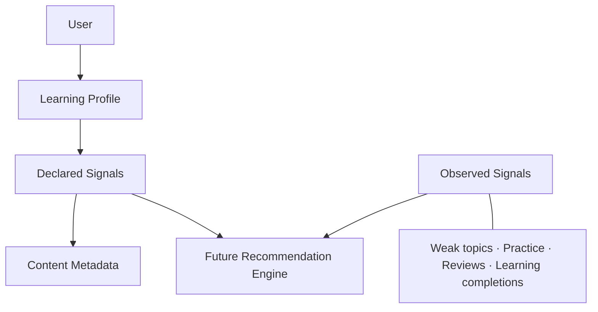

# Learning Profile

## Purpose

Learning Profile stores the current user's declared learning direction. It provides stable inputs for future content discovery without coupling recommendation work to authentication or account identity.

Learning Profile contains user-provided preference and experience signals. It is not an objective assessment of developer skill.

Learning Profile is optional for existing DevRecall functionality. Users without a configured profile can continue using Knowledge, Practice, Review, Study, and Analytics.

## Domain model

Each user can own at most one profile. The aggregate contains:

- target role;
- current experience level;
- available study minutes per day;
- one or more structured technologies, optionally marked primary;
- one or more structured learning goals;
- an optimistic concurrency version.

Technology and goal collections have unique database constraints. Values use a deliberately small, stable taxonomy; free-text values are not accepted.

The existing onboarding preference remains separate. Onboarding controls the initial product experience, while Learning Profile supplies declared signals for v2 content discovery.

## Configuration semantics

An absent profile is a normal state. `GET /api/v1/learning-profile` returns HTTP 200 with `isConfigured: false`, empty collections, and nullable scalar values.

A persisted profile is complete and therefore configured. Initial creation requires all five signal groups. Partial database aggregates are not stored.

Daily availability uses the canonical options `15`, `30`, `45`, `60`, `90`, and `120` minutes. These are personalization buckets rather than precise time tracking. A profile can contain 1-20 technologies, at most five marked primary, and 1-10 goals.

## API

| Method | Route | Purpose |
| --- | --- | --- |
| `GET` | `/api/v1/learning-profile` | Read the authenticated user's profile. |
| `GET` | `/api/v1/learning-profile/options` | Read stable values and English display metadata. |
| `PUT` | `/api/v1/learning-profile` | Create or replace the authenticated user's profile. |

The server derives ownership from the authenticated session. Requests never accept a user ID. Public enum values are case-sensitive strings; numeric enum representations are rejected.

All three endpoints, including the static options endpoint, require an authenticated user. Options are generated from application metadata and do not query PostgreSQL.

Example update request:

```json
{
  "targetRole": "BackendDeveloper",
  "experienceLevel": "Junior",
  "availableMinutesPerDay": 45,
  "technologies": [
    { "name": "CSharp", "isPrimary": true },
    { "name": "DotNet", "isPrimary": true }
  ],
  "goals": ["PrepareForInterviews"],
  "expectedVersion": 1
}
```

## Concurrency and no-op behavior

Creation requires `expectedVersion: null`. Updating an existing profile requires the current version. A stale or invalid expectation returns HTTP 409 with `LEARNING_PROFILE_CONFLICT`.

Technology and goal ordering is not semantically significant. Submitting an unchanged profile does not call `SaveChanges`, increment `version`, or change `updatedAtUtc`.

The PUT response is the canonical saved profile. Clients update their cache from it and do not need a follow-up GET.

The database enforces the singleton and collection invariants with named unique indexes:

- `uq_learning_profiles_user_id`;
- `uq_learning_profile_technologies_profile_technology`;
- `uq_learning_profile_goals_profile_goal`.

The profile version is an EF Core concurrency token. Role, technologies, goals, and availability are updated with one `SaveChanges` boundary. A create race is resolved by the user-ID unique index and mapped to `LEARNING_PROFILE_CONFLICT`.

## Product integration

Learning Profile remains a Settings concern and does not add a top-level navigation item. Settings always exposes its configured or setup state. Today may show a secondary, non-blocking setup invitation after the primary learning experience has loaded.

Saving updates the shared private profile cache directly. The user can return to Today explicitly; there is no forced redirect. Once configured, the Today invitation disappears. Logout uses the existing private-cache cleanup, preventing one user's configured state from leaking into the next session.

Learning Profile is never required to enter or use Today, Knowledge, Review, Interview, DSA, Study Plans, Study Sessions, Weak Topics, Recommendations, or Analytics.

## Deliberate exclusions

This foundation does not score profiles, infer skill, recommend content, modify Today priority, rewrite onboarding, ingest external resources, or introduce AI behavior.

## Declared and observed signals

Learning Profile is the canonical source of declared signals: what the user says they are working toward. It remains separate from observed signals produced by actual learning behavior.



The internal `LearningProfileSignals` contract preserves target role, experience level, primary technologies, other technologies, goals, available minutes, and configured state. It does not infer technologies from a role or convert a self-reported level into a skill score.

Future recommendation work may combine these declared signals with observed signals, but the two sources retain clear provenance.

## Future content matching contract

Learning Content should provide enough metadata to compare candidates along these dimensions:

- target roles;
- technologies;
- difficulty;
- estimated minutes;
- goals or intent;
- topics.

An empty target-role collection means role-neutral content, not content that matches nobody. Technology metadata follows the same principle when empty.

Expected difficulty compatibility is deliberately soft: Beginner content suits beginners; Junior users may receive Beginner or Intermediate content; Mid-level and Senior users may receive Intermediate or Advanced content. No persistent mapping table or scoring rule exists yet.

Estimated duration is also a soft signal. Content longer than the user's daily availability remains discoverable. Goal matching will eventually influence ranking—for example, interview preparation can favor core concepts and common interview topics—but no matching or scoring is implemented during Week 1.

## Privacy and lifecycle boundaries

External catalog acquisition is global. DevRecall must not send a user's profile, identity, career intent, or goals to an external content provider merely to fetch catalog data. Personalization occurs inside DevRecall.

Learning Profile data is used internally by DevRecall for personalization and is not sent to external content providers by default.

A future recommendation may persist the specific reason signals needed to explain why it was generated; it should not snapshot the whole profile by default.

Changing a Learning Profile may make future Discover recommendations stale. It does not:

- create learning activity or analytics evidence;
- change Weak Topics;
- rewrite Knowledge or Review history;
- mutate an existing Study Plan;
- rewrite historical recommendations.

Updating Learning Profile is a settings operation, not a learning activity. It does not change Study Minutes, Active Days, learning streaks, Weak Topics, practice history, Study Plans, or existing Recommendations.

Declared data records what the user says; observed data records what learning evidence shows. Future personalization may use both, but neither source silently overwrites the other.

Users without a Learning Profile retain full access to existing v1 workflows. Future Discover behavior should fall back to curated or popular content instead of treating a missing profile as an error.

Taxonomy values are application constants rather than database-managed catalog rows. Existing values must not be removed casually because persisted profiles may reference them. A future option can be hidden or deprecated while retaining its stable stored value.
